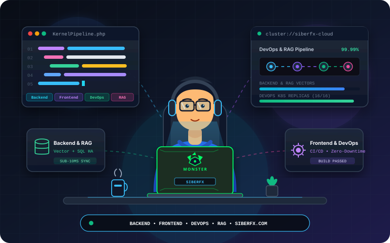

<!-- https://media.giphy.com/media/SWoSkN6DxTszqIKEqv/giphy.gif -->
<!--  -->

 * How to reach me: [contact@siberfx.com](mailto:contact@siberfx.com)
 * My website: [https://siberfx.com/](https://siberfx.com/)
 * [ @siberfx](https://instagram.com/siberfx)
 * [ @siberfx](https://www.linkedin.com/in/siberfx/)
 * [ @siberfx](https://x.com/siberfx)
 * [ @siberfx](https://t.me/siberfx)

  
  

 
 
 
 
 

  

<picture>
  <source media="(prefers-color-scheme: dark)" srcset="https://raw.githubusercontent.com/siberfx/siberfx/main/image/tech-stack-dark.svg" />
  <source media="(prefers-color-scheme: light)" srcset="https://raw.githubusercontent.com/siberfx/siberfx/main/image/tech-stack-light.svg" />
  
</picture>

 
 

<picture>
  <source media="(prefers-color-scheme: dark)" srcset="https://raw.githubusercontent.com/siberfx/siberfx/output/bomberman-contribution-graph-dark.svg" />
  <source media="(prefers-color-scheme: light)" srcset="https://raw.githubusercontent.com/siberfx/siberfx/output/bomberman-contribution-graph.svg" />
  
</picture>

 
 

**Latest Articles:**

<ul>
<!-- BLOG-POST-LIST:START --><li><a href="https://siberfx.com/article/ai/deploying-groqs-llama-31-with-langchain-for-realtime-customer-support-in-kubernetes">Deploying Groq’s Llama 3.1 with LangChain for Real‑Time Customer Support in Kubernetes</a> — Nov 17, 2026</li>
<li><a href="https://siberfx.com/article/react/leveraging-usesyncexternalstore-for-global-configuration-in-react">Leveraging useSyncExternalStore for Global Configuration in React</a> — Nov 17, 2026</li>
<li><a href="https://siberfx.com/article/laravel/prioritizing-laravel-queue-jobs-with-a-servicecontainerbacked-middleware">Prioritizing Laravel Queue Jobs with a Service‑Container‑Backed Middleware</a> — Nov 16, 2026</li>
<li><a href="https://siberfx.com/article/security/cve-2026-109518-critical-apt-vulnerability-in-debian-and-ubuntu">CVE-2026-109518: Critical APT Vulnerability in Debian and Ubuntu</a> — Nov 15, 2026</li>
<li><a href="https://siberfx.com/article/linux/automating-ssh-key-rotation-with-openssh-and-systemd-timers">Automating SSH Key Rotation with OpenSSH and Systemd Timers</a> — Nov 15, 2026</li>
<!-- BLOG-POST-LIST:END -->
</ul>

➡️ [More articles](https://siberfx.com/)

